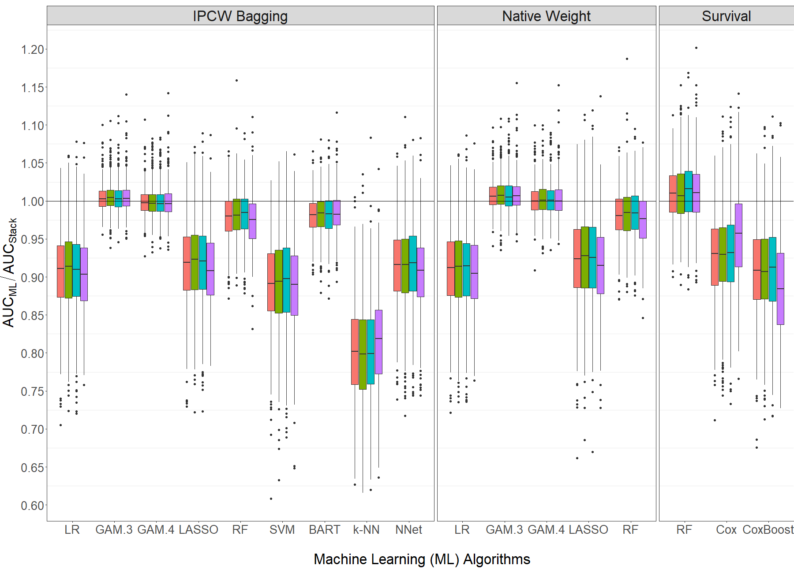

# stackBagg: Stacked IPCW Bagging


**stackBagg** is an `R` package that uses inverse probability of censoring weighted
(IPCW) bagging approach as a pre-processing step to allow for all existing and any
newly developed machine learning methods for classification to be applied to right-censored data with or
without competing risk.

**stackBagg** provides the files to reproduce the simulation studies and the real data application in the forthcoming paper:
* Gonzalez Ginestet, P. et al. (2019). "Stacked IPCW Bagging: a case study in the HIV care
registry".



AUCs of each algorithm relative to the AUC of the stack based on 500 simulated data sets under the four scenarios (A=orange, B=green, C=blue and D=violet) using all available covariates and a Cox-PH model for censoring for predicting the event of interest in the test data set. The horizontal line denotes the stack.

## Important Note

The real data application in the paper relies on Swedish HIV care register (InfCareHIV) that cannot be openly shared. The data available on the folder fake_data is based on a fake, simulated  data that mimics the data used for the analysis. The R script which run the analysis of the data set is the same as the used for the analysis, but analysis results cannot be exactly reproduced. 

## Organization of folders

The folder simulations contains the R file which runs the simulation and reproduces the main figures of the paper (AUC of each single algorithm relative to the AUC of the stack) and tables with the average estimated AUCs. The tables complement the figures and they are found in the supplementary material . 

R folder contains, among other files, the file datageneration.R that generates the simulated data for the different simulation studies and scenarios.

The folder pre_process_step_raw_data contains the R file with all preprocessing step applied to the raw dataset to get the final dataset that was used in the analysis. The final data is the same that is found in the folder fake_data.

The folder fake_data contains the fake data and the file that runs the analsys.

The folder data constains the data used as example, the same that is shipped with the package.


## Installation

You can install the development version of `stackBagg` from [GitHub](https://github.com/pablogonzalezginestet/stackBagg) with:


```R
if (!require("devtools")) install.packages("devtools")
devtools::install_github("pablogonzalezginestet/stackBagg")
```


## Vignette


See the vignette for details about examples usage of the functions found in  `stackBagg`: [online vignette](https://pablogonzalezginestet.github.io/stackBagg/)


